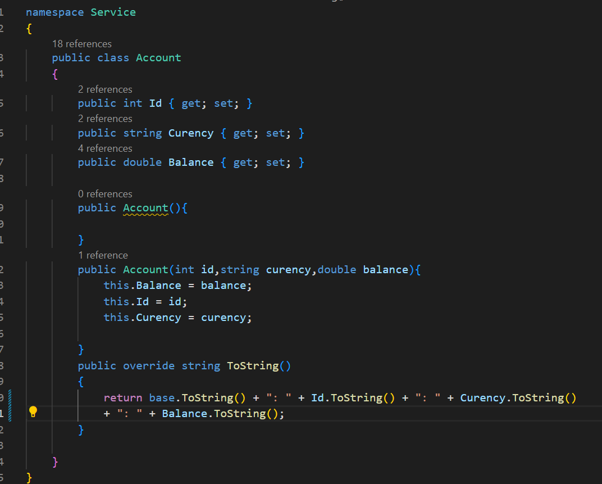
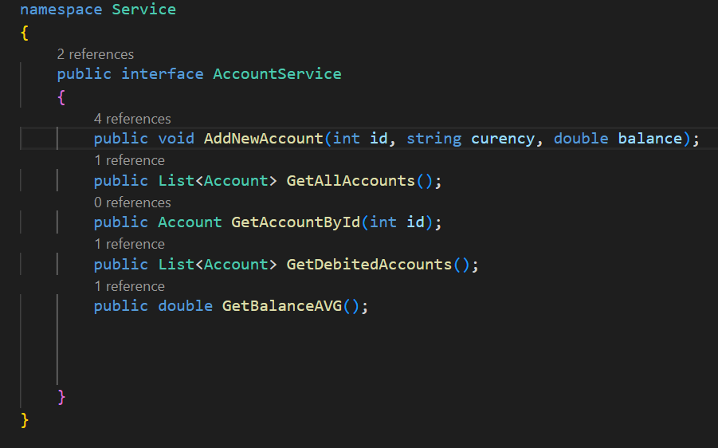
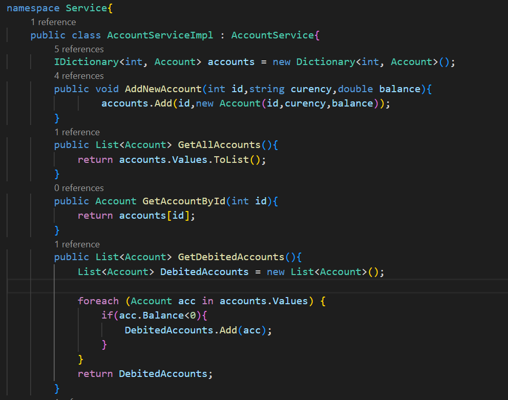
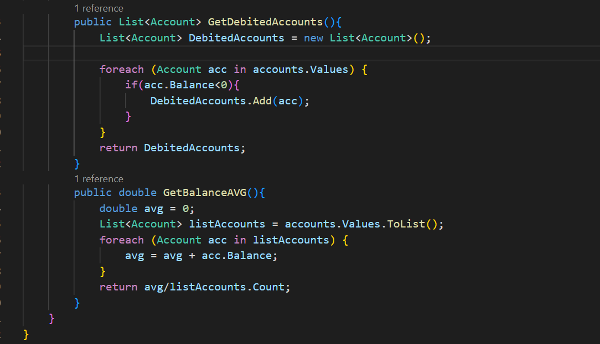
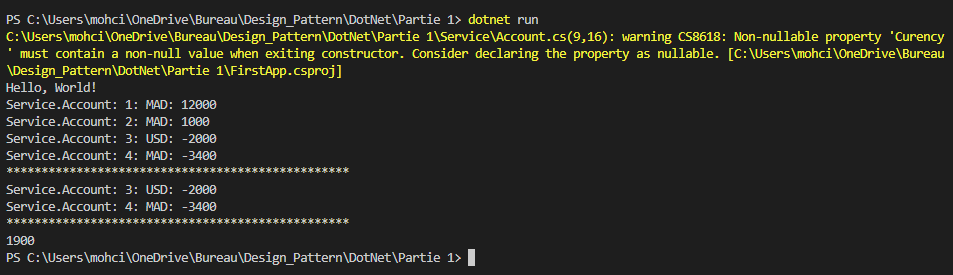
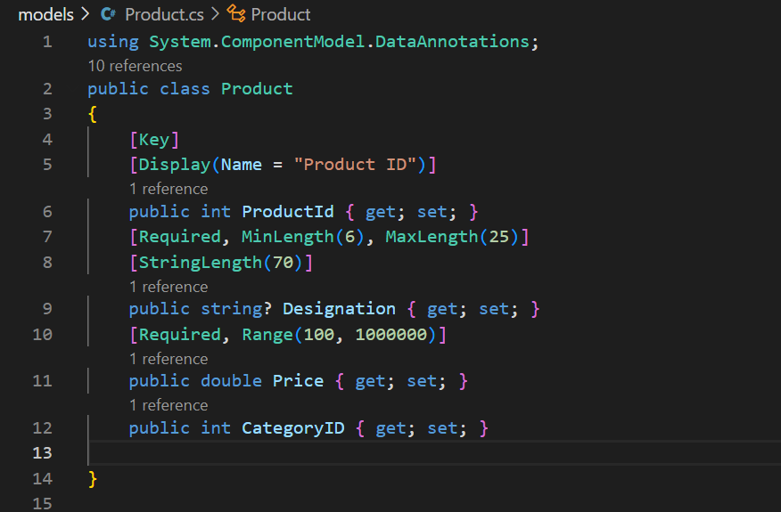
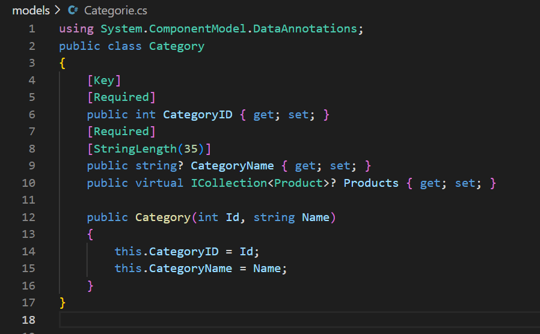
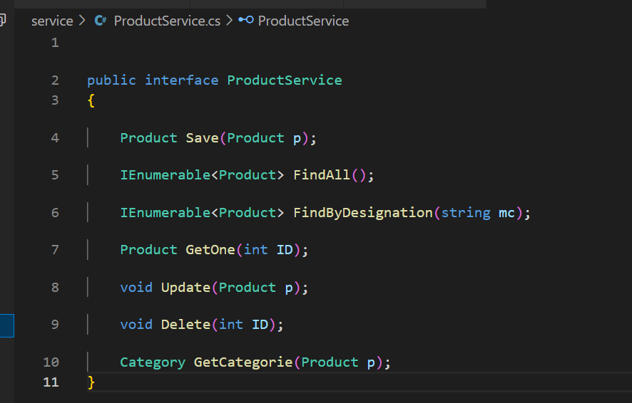
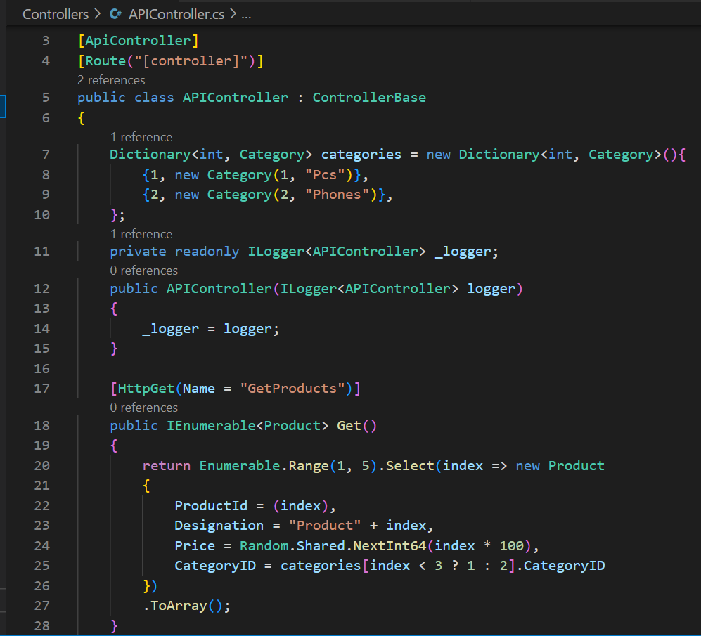
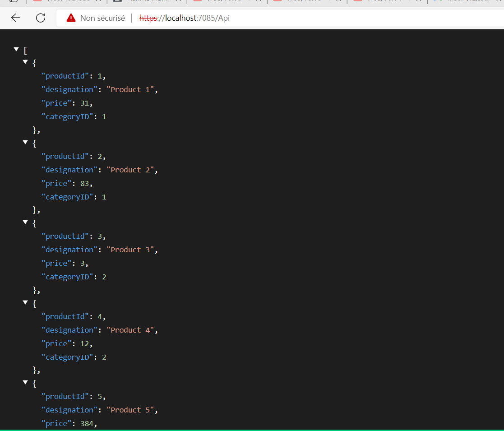

# Application DotNet Core de type console qui permet gérer des comptes (id, curency, balance)

## Account

## AcountService Interface

## AcountService impl

## Test

# Application DotNet Core de type WebAPI qui permet gérer des produits appartenant à des catégories

## Entity Product

## Entity Category

## Product Service

## Controller

## Test

